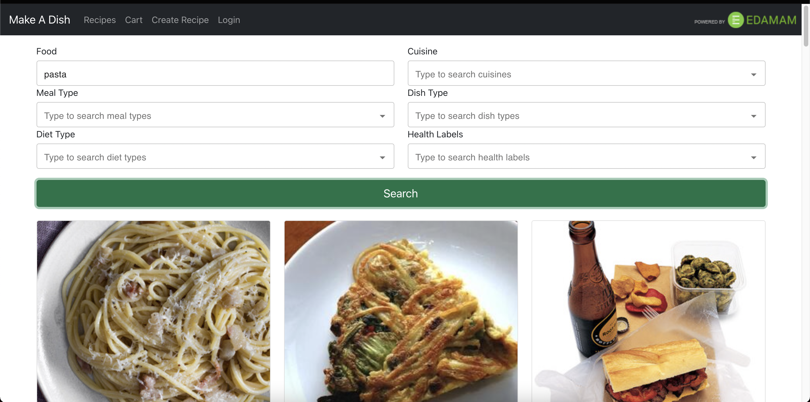
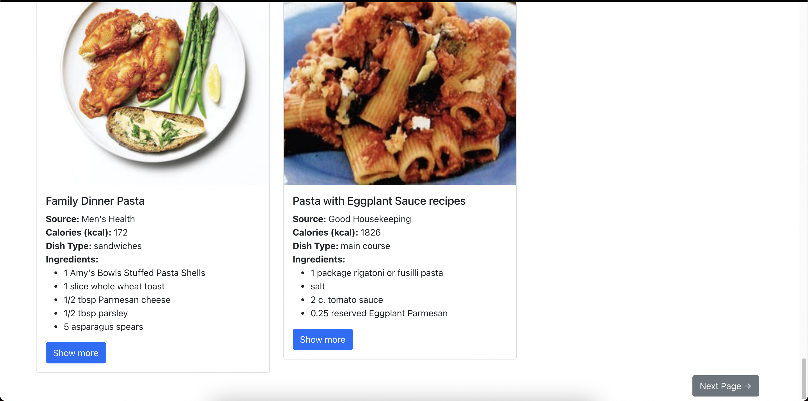
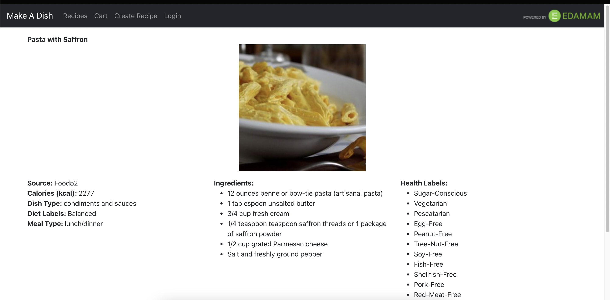
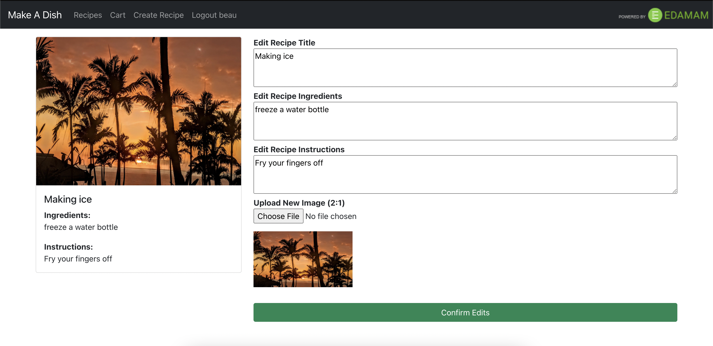
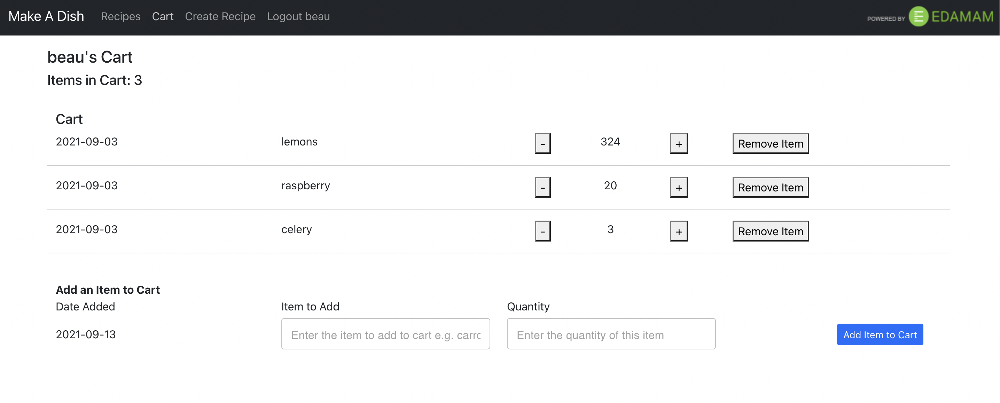
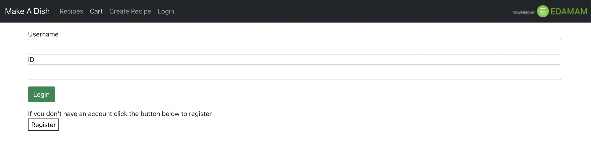

# make-a-dish

A web application consisting of three main pages: recipe lookup, cart, and user recipe list. 

## Recipe Lookup

The lookup page features six queries by which the user can filter through the Edamam API for recipes that matches the queries. Every page features 20 different
recipes, and the user can navigate to the proceeding pages by the Next Page button located at the bottom of the list. The cards on which the recipes are displayed
shows the original source of the recipes, calorie count, dish type, and up to 7 ingredients. A full list of ingredients and more information can be found by clicking 
the show more button at the bottom of each card.

## Cart

Simple storage area wherein users can keep track of ingredients in a list format.

## User Recipe List

Here, users can create, update, and delete their own recipes.

## Images

### Top of Recipe Lookup

### Bottom of Recipe Lookup

### Individual Recipe Page

### Create a Recipe Page

### Edit User Recipes

### Cart

### Login Page

